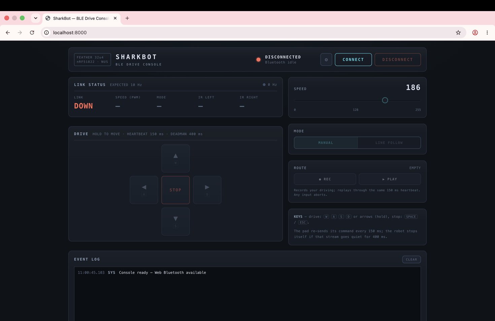

# SharkBot — Web Bluetooth Robot Car Dashboard

A single-page dashboard that connects **directly from the browser** to an Adafruit Feather 32u4 Bluefruit LE over Bluetooth Low Energy and drives a four-motor robot car. No server, no app, no build step — it replaces Adafruit's Bluefruit Connect mobile app with a page I wrote.

```
Chrome / Edge  ──Web Bluetooth──▶  nRF51822 (BLE UART)  ──SPI──▶  ATmega32u4  ──I²C──▶  Motor Shield v2  ──▶  4× DC motors
  index.html                              Feather 32u4 Bluefruit LE              firmware/robot_control.ino
```



---

## The interesting problem: uncommanded motion

A dropped BLE connection while the motors are running is a runaway vehicle. A naive implementation sends "forward" once and the robot drives forever — closing the browser tab is enough to lose the car.

So the system never trusts a single command. It requires continuous proof that a human is still there:

| Layer | Behaviour |
|---|---|
| **Browser — 150 ms heartbeat** | While a drive button is held, the page re-sends the command every 150 ms. Line-follow mode re-sends `M1` on the same cadence. Releasing sends `S`. |
| **Firmware — 400 ms deadman** | Every received command refreshes a timestamp. If the robot is moving and 400 ms pass in silence, the firmware releases all four motors and drops to manual on its own. |

Two missed heartbeats are survivable; a dead link is not, by design. Closing the tab, walking out of range, and killing the browser all look identical to the firmware — silence, then stop.

The page adds its own interlocks on top: releasing a button, switching tabs, backgrounding the window, or losing the GATT link all halt the drive immediately. A lost link locks the controls with **no silent auto-reconnect** — reconnecting is a deliberate human action.

---

## Protocol

Plain ASCII, newline-terminated — chosen over binary packets so it can be driven from a serial monitor during bring-up.

**Browser → robot** (unknown commands ignored):

| Command | Meaning |
|---|---|
| `F` `B` `L` `R` | forward / back / pivot left / pivot right (hold-to-drive) |
| `S` | stop — all four motors released |
| `V<0-255>` | set speed, e.g. `V180` |
| `M0` / `M1` | manual / line-follow mode |

**Robot → browser:**

| Line | Cadence |
|---|---|
| `T,<irL>,<irR>,<speed>,<mode>` | 10 Hz — outer IR readings (raw 0–1023), confirmed speed, confirmed mode |
| `E,DEADMAN` | firmware stopped itself; surfaced in red in the event log |

BLE notifications fragment at 20 bytes, so the page buffers incoming bytes and only parses on `\n` — one notification is not one line.

---

## Browser support

Works in **Chrome or Edge** on Windows, macOS, ChromeOS, Linux, and Android. Web Bluetooth is not implemented in Safari or Firefox, and every iOS browser uses Safari's engine underneath — so **iPhone and iPad cannot run this at all**. Unsupported browsers get a plain explanation instead of a dead dashboard.

---

<details>
<summary><b>Setup — flashing and serving</b></summary>

### Flash the firmware

Arduino IDE, once:

1. `File → Preferences → Additional Boards Manager URLs`, add
   `https://adafruit.github.io/arduino-board-index/package_adafruit_index.json`
2. `Tools → Board → Boards Manager` — install **Adafruit AVR Boards**, select **Adafruit Feather 32u4**.
3. `Tools → Manage Libraries` — install **Adafruit Motor Shield V2 Library** and **Adafruit BluefruitLE nRF51**.

Then open `firmware/robot_control.ino`, select the Feather's port, and upload. If the upload fails or the port vanishes, double-tap the reset button — the bootloader port appears for about 8 seconds while the LED pulses. Upload again during that window.

### Serve the page

Web Bluetooth requires a secure context, so `file://` is unreliable:

```bash
cd sharkbot
python3 -m http.server 8000
# open http://localhost:8000 in Chrome or Edge
```

GitHub Pages works as a free HTTPS host. Nothing else changes — the BLE connection is always browser→robot, never through a server.

### Drive it

Power the robot (4×AA motors, USB logic). It advertises as **SharkBot**. Click CONNECT — the chooser only opens from a real click, which is a Web Bluetooth rule — and pick it from the list. Telemetry starts updating at ~10 Hz, which is your proof the link is live.

Hold a direction button, or W/A/S/D, or the arrow keys. Space or Escape is an immediate stop.

</details>

<details>
<summary><b>Line following</b></summary>

Five reflectance sensors on `A0`–`A4` are read every loop. Any reading above the threshold counts as seeing the line:

- Either left sensor sees black → turn left
- Else either right sensor sees black → turn right
- Else the middle sensor sees black → drive forward
- Else nothing sees the line → stop

Any manual drive command received during line-follow drops the robot back to manual immediately. Retune the threshold with a serial monitor if your track or lighting differs.

</details>

<details>
<summary><b>Bench testing without the page</b></summary>

The sketch accepts the same commands over USB serial (115200 baud, newline endings). Type `F` and the car drives — then stops about 400 ms later. That's the deadman working, since the serial monitor sends no heartbeat. `V60` first makes bench testing gentler. Received commands echo back as `> F`.

</details>

<details>
<summary><b>Troubleshooting</b></summary>

| Symptom | Cause / fix |
|---|---|
| Robot not in the chooser | Unpowered, out of range, or OS Bluetooth off. On Linux try `chrome://flags/#enable-experimental-web-platform-features`. |
| `SecurityError` on `getPrimaryService` | `optionalServices` missing from `requestDevice` — mandatory even when the service is already in `filters`. |
| Connects, no errors, nothing happens | The RX/TX swap. The browser writes to `…0002` and subscribes to `…0003`; they're named from the peripheral's side. Backwards is a silent no-op. |
| Upload fails / port missing | Double-tap reset, upload while the LED pulses. |
| Compiles but behaves erratically | RAM exhaustion. 2.5 KB total: no `String`, literals in `F()`, telemetry printed field by field. |
| One wheel spins backwards | Swap that motor's two leads at the shield terminal. |
| Left and right turns are mirrored | Motor pairs swapped — `MOTOR_A/B` should be the right side, `MOTOR_C/D` the left. |
| Works on USB, dies on battery | Power, not code. Motor current sagging the logic rail. Fresh AAs first, then confirm motor and logic power are on separate rails. |
| Telemetry shows STALE while connected | Notifications died without a disconnect event. Reconnect and check robot power. |

</details>

---

## Hardware

| Part | Detail |
|---|---|
| Board | Adafruit Feather 32u4 Bluefruit LE (ATmega32u4 + nRF51822, 2.5 KB SRAM) |
| Motors | 4× DC via Adafruit Motor Shield v2 (I²C) — `MOTOR_A/B` right pair, `MOTOR_C/D` left |
| Sensors | 5-sensor analog IR reflectance array on `A0`–`A4` |
| BLE | Hardware SPI — CS 8, IRQ 7, RST 4 |
| Power | 4×AA for motors, USB for logic |
| Chassis | Self-designed in Fusion 360, 3D printed |

Motor shield is I²C and BLE is SPI, so there's no pin conflict.

## Files

| File | Purpose |
|---|---|
| `index.html` | The entire dashboard — HTML, CSS, and JS inline, framework-free |
| `firmware/robot_control.ino` | Arduino sketch for the Feather 32u4 |
